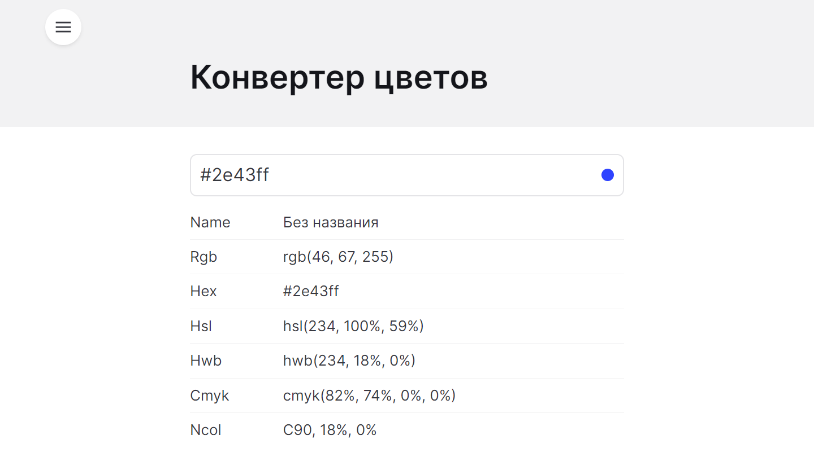
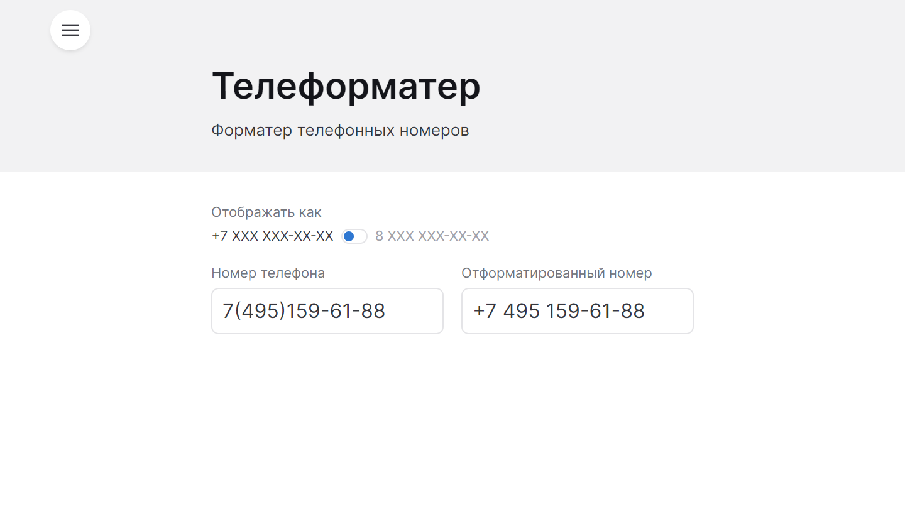
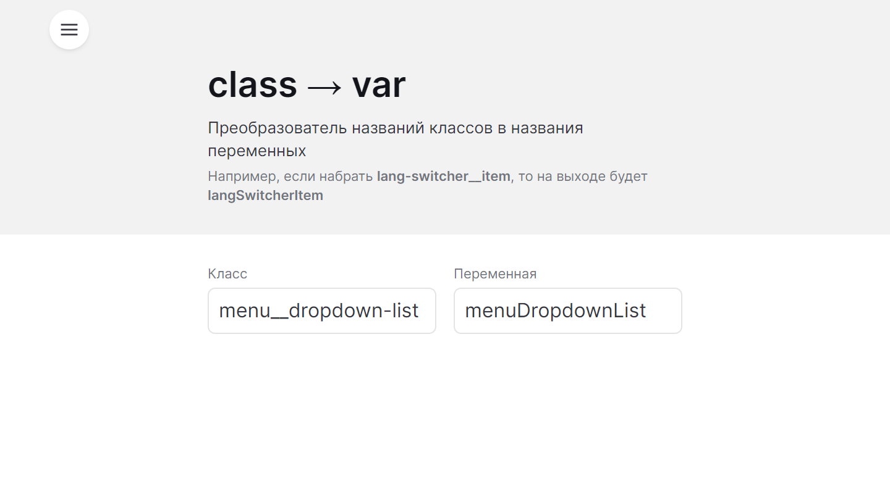

# Полезные штуки

## Конвертер цветов

[Открыть](https://nameasy.github.io/tools/color-converter)

## Телеформатер

Форматер телефонных номеров

[Открыть](https://nameasy.github.io/tools/phone-formatter)

## class → var

Преобразователь названий классов в названия переменных

[Открыть](https://nameasy.github.io/tools/class-to-var)

